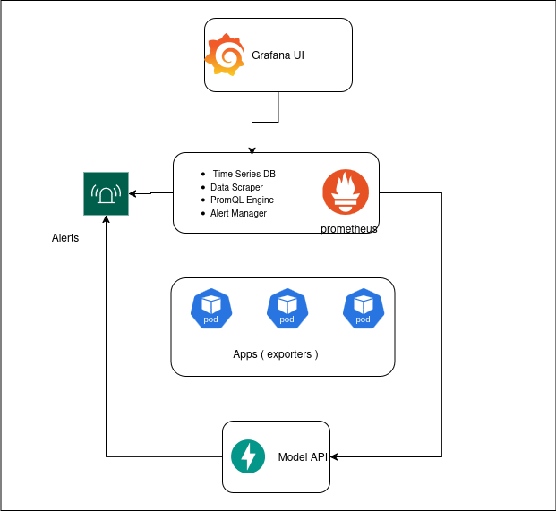

# Real-time Anomaly Detection System Using VAE-LSTM

A  system for detecting anomalies in time-series metrics data using a Variational Autoencoder-Long Short-Term Memory (VAE-LSTM) hybrid model integrated with Prometheus and Grafana in Kubernetes environments.

## Overview

This project implements an advanced anomaly detection pipeline that continuously analyzes system metrics to identify potential system failures before they impact services. By combining deep learning techniques with industry-standard monitoring tools, this system provides reliable detection with minimal false positives.

> ⚠️ **Inspiration**: This work is inspired by the research paper *"Anomaly Detection for Time Series Using VAE-LSTM Hybrid Model"*  
> [IEEE Xplore Link](https://ieeexplore.ieee.org/document/9053558)



## Features

- **VAE-LSTM Hybrid Model**: Combines the strengths of Variational Autoencoders and LSTM networks for robust time-series anomaly detection
- **Real-time Processing**: Analyzes metrics data every 5 minutes to provide timely anomaly detection
- **Prometheus Integration**: Seamlessly works with Prometheus for metrics collection and storage
- **Grafana Dashboards**: Rich visualizations of metrics and anomaly detection results
- **Alerting System**: Configurable alerts with context-aware notifications
- **Kubernetes Deployment**:  deployment configurations for Kubernetes

## Requirements

- Python 3.10+
- PyTorch 2+
- Prometheus 2.30+
- Grafana 8.0+
- Kubernetes 1.26+
- Docker

## Getting Started


### 2. Install dependencies

```bash
pip install -r requirements.txt
```


### 4. Train the model

```bash
python train.py --config config/model_config.yaml --data path/to/training/data
```

### 5. Deploy to Kubernetes (coming soon)

```bash
# kubectl apply -f kubernetes/
```

## Usage

### Training the Model (coming soon)

To train the model on your own dataset:

```bash
# python src/models/train.py --config config/model_config.yaml 
```

### Running Inference Locally (coming soon)

